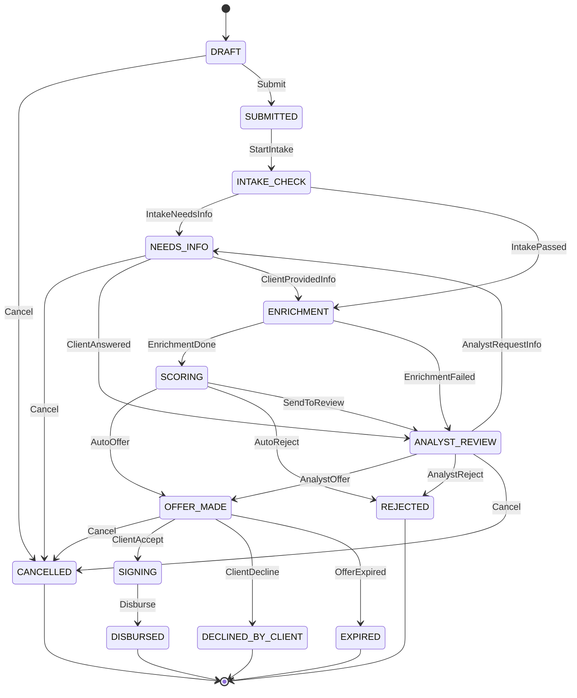

# Диаграмма состояний заявки

Файл сгенерирован тестом `internal/workflow` (`UPDATE_DOCS=1 go test ./internal/workflow`). Не редактировать вручную.

```mermaid
stateDiagram-v2
    [*] --> DRAFT
    DRAFT --> CANCELLED: Cancel
    DRAFT --> SUBMITTED: Submit
    SUBMITTED --> INTAKE_CHECK: StartIntake
    INTAKE_CHECK --> NEEDS_INFO: IntakeNeedsInfo
    INTAKE_CHECK --> ENRICHMENT: IntakePassed
    NEEDS_INFO --> CANCELLED: Cancel
    NEEDS_INFO --> ANALYST_REVIEW: ClientAnswered
    NEEDS_INFO --> ENRICHMENT: ClientProvidedInfo
    ENRICHMENT --> SCORING: EnrichmentDone
    ENRICHMENT --> ANALYST_REVIEW: EnrichmentFailed
    SCORING --> OFFER_MADE: AutoOffer
    SCORING --> REJECTED: AutoReject
    SCORING --> ANALYST_REVIEW: SendToReview
    ANALYST_REVIEW --> OFFER_MADE: AnalystOffer
    ANALYST_REVIEW --> REJECTED: AnalystReject
    ANALYST_REVIEW --> NEEDS_INFO: AnalystRequestInfo
    ANALYST_REVIEW --> CANCELLED: Cancel
    OFFER_MADE --> CANCELLED: Cancel
    OFFER_MADE --> SIGNING: ClientAccept
    OFFER_MADE --> DECLINED_BY_CLIENT: ClientDecline
    OFFER_MADE --> EXPIRED: OfferExpired
    SIGNING --> DISBURSED: Disburse
    DISBURSED --> [*]
    REJECTED --> [*]
    DECLINED_BY_CLIENT --> [*]
    EXPIRED --> [*]
    CANCELLED --> [*]
```
